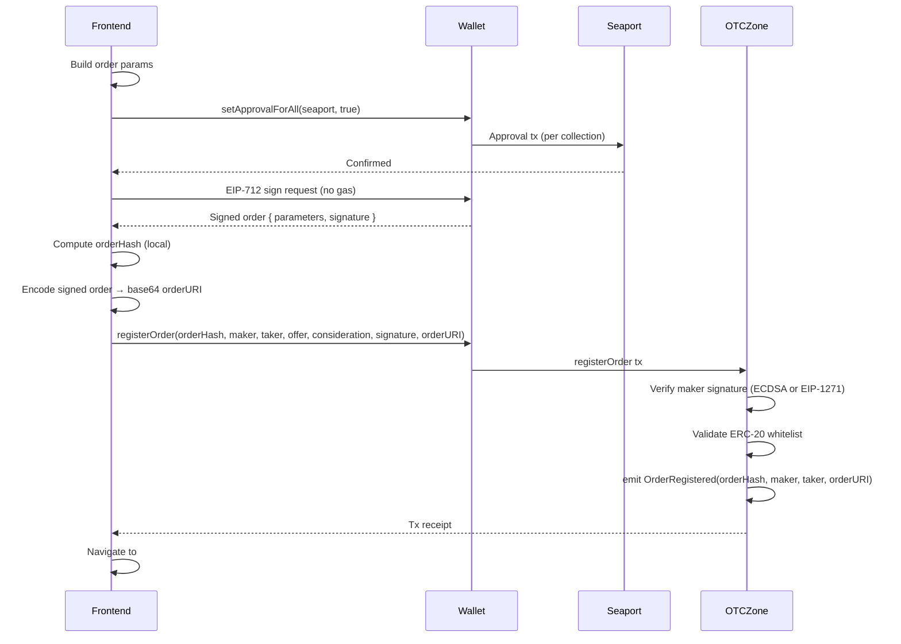
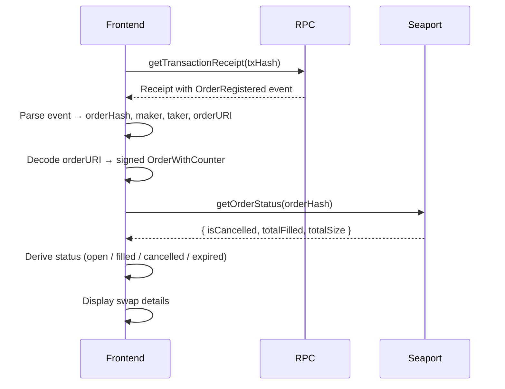
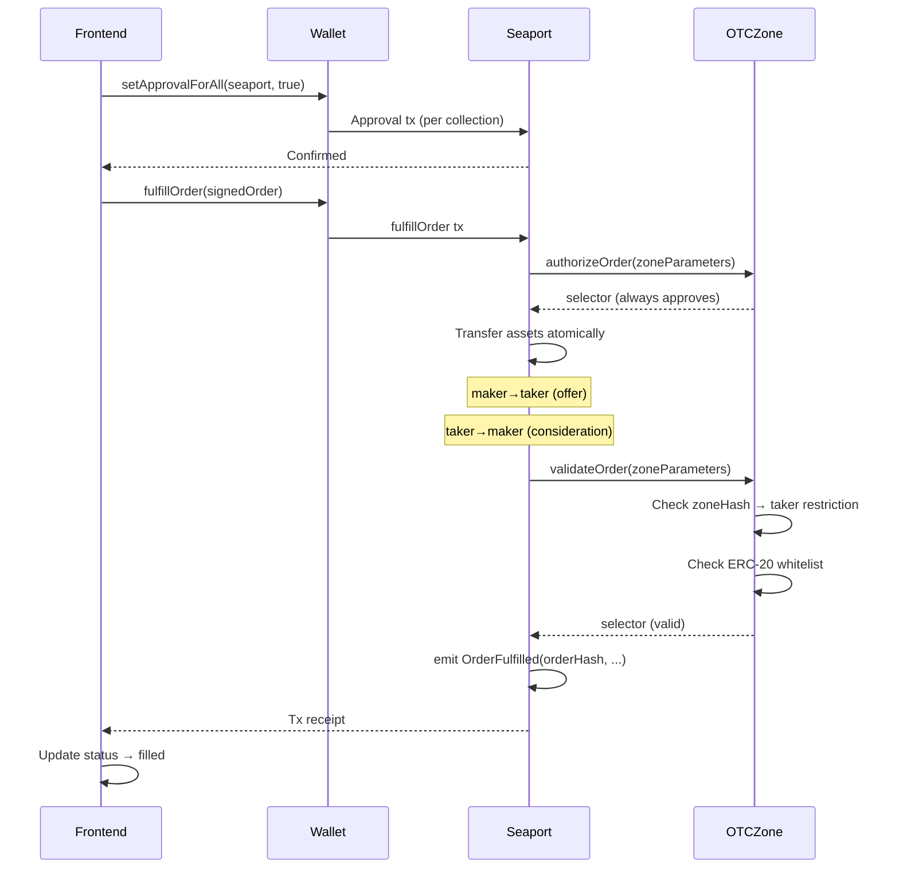
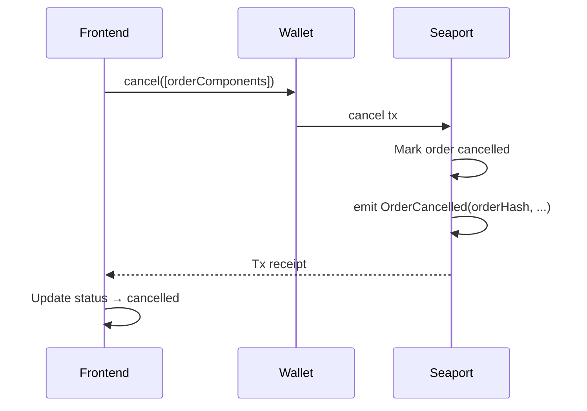
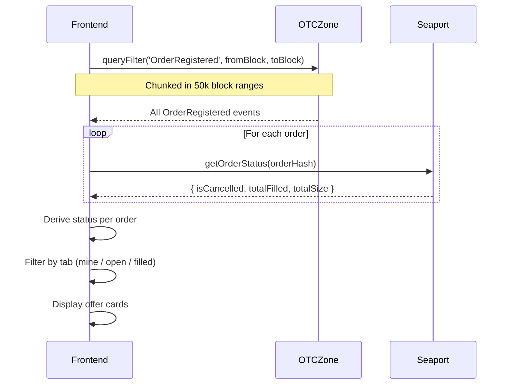

# ocarina.trade — System Interaction Flows

## Create Order

```mermaid
sequenceDiagram
    participant F as Frontend
    participant W as Wallet
    participant S as Seaport
    participant Z as OTCZone

    F->>F: Build order params

    F->>W: setApprovalForAll(seaport, true)
    W->>S: Approval tx (per collection)
    S-->>F: Confirmed

    F->>W: EIP-712 sign request (no gas)
    W-->>F: Signed order { parameters, signature }

    F->>F: Compute orderHash (local)
    F->>F: Encode signed order → base64 orderURI

    F->>W: registerOrder(orderHash, maker, taker, offer, consideration, signature, orderURI)
    W->>Z: registerOrder tx
    Z->>Z: Verify maker signature (ECDSA or EIP-1271)
    Z->>Z: Validate ERC-20 whitelist
    Z->>Z: emit OrderRegistered(orderHash, maker, taker, orderURI)
    Z-->>F: Tx receipt

    F->>F: Navigate to #/swap/{chainId}/{txHash}
```

## View Swap (Load from URL)

```mermaid
sequenceDiagram
    participant F as Frontend
    participant R as RPC
    participant S as Seaport

    F->>R: getTransactionReceipt(txHash)
    R-->>F: Receipt with OrderRegistered event

    F->>F: Parse event → orderHash, maker, taker, orderURI
    F->>F: Decode orderURI → signed OrderWithCounter

    F->>S: getOrderStatus(orderHash)
    S-->>F: { isCancelled, totalFilled, totalSize }

    F->>F: Derive status (open / filled / cancelled / expired)
    F->>F: Display swap details
```

## Accept (Fill) Order

```mermaid
sequenceDiagram
    participant F as Frontend
    participant W as Wallet
    participant S as Seaport
    participant Z as OTCZone

    F->>W: setApprovalForAll(seaport, true)
    W->>S: Approval tx (per collection)
    S-->>F: Confirmed

    F->>W: fulfillOrder(signedOrder)
    W->>S: fulfillOrder tx

    S->>Z: authorizeOrder(zoneParameters)
    Z-->>S: selector (always approves)

    S->>S: Transfer assets atomically
    Note over S: maker→taker (offer)
    Note over S: taker→maker (consideration)

    S->>Z: validateOrder(zoneParameters)
    Z->>Z: Check zoneHash → taker restriction
    Z->>Z: Check ERC-20 whitelist
    Z-->>S: selector (valid)

    S->>S: emit OrderFulfilled(orderHash, ...)
    S-->>F: Tx receipt

    F->>F: Update status → filled
```

## Cancel Order

```mermaid
sequenceDiagram
    participant F as Frontend
    participant W as Wallet
    participant S as Seaport

    F->>W: cancel([orderComponents])
    W->>S: cancel tx

    S->>S: Mark order cancelled
    S->>S: emit OrderCancelled(orderHash, ...)
    S-->>F: Tx receipt

    F->>F: Update status → cancelled
```

## Browse Offers

```mermaid
sequenceDiagram
    participant F as Frontend
    participant Z as OTCZone
    participant S as Seaport

    F->>Z: queryFilter('OrderRegistered', fromBlock, toBlock)
    Note over F,Z: Chunked in 50k block ranges
    Z-->>F: All OrderRegistered events

    loop For each order
        F->>S: getOrderStatus(orderHash)
        S-->>F: { isCancelled, totalFilled, totalSize }
    end

    F->>F: Derive status per order
    F->>F: Filter by tab (mine / open / filled)
    F->>F: Display offer cards
```
